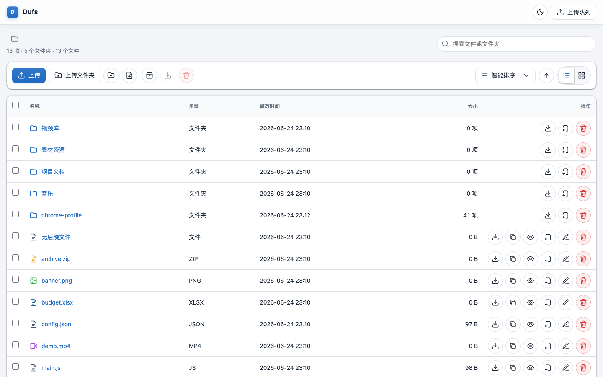
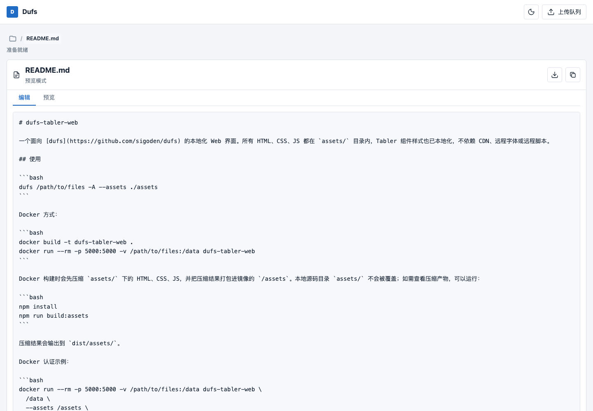

# dufs-tabler-web

Una interfaz web localizada para [dufs](https://github.com/sigoden/dufs). Todo el HTML, CSS y JavaScript residen en el directorio `assets/`, y los estilos de los componentes de Tabler están empaquetados localmente. No depende de CDNs, fuentes remotas ni scripts remotos.

[中文 README](README_zh.md)

## Vista previa





## Uso

```bash
dufs /path/to/files -A --assets ./assets
```

Docker:

```bash
docker build -t dufs-tabler-web .
docker run --rm -p 5000:5000 -v /path/to/files:/data dufs-tabler-web
```

La compilación de Docker primero minifica el HTML, CSS y JavaScript bajo `assets/`, y luego empaqueta los archivos generados en `/assets` dentro de la imagen. El directorio de origen local `assets/` no se sobrescribe. Para inspeccionar la salida minificada localmente, ejecuta:

```bash
npm install
npm run build:assets
```

La salida generada se escribe en `dist/assets/`.

Ejemplo de autenticación en Docker:

```bash
docker run --rm -p 5000:5000 -v /path/to/files:/data dufs-tabler-web \
  /data \
  --assets /assets \
  --allow-upload \
  --allow-delete \
  --allow-search \
  --allow-archive \
  -a admin:admin@/:rw \
  -b 0.0.0.0 \
  -p 5000
```

Docker Compose:

```bash
docker compose up --build
```

Por defecto, sirve el directorio actual en `http://127.0.0.1:5050`. Puedes configurar el directorio de datos y el puerto con variables de entorno:

```bash
DUFS_DATA=/path/to/files DUFS_PORT=5000 docker compose up --build
```

Modo de autenticación de Docker Compose:

```bash
DUFS_DATA=/path/to/files docker compose --profile auth up --build dufs-auth
```

El modo de autenticación utiliza por defecto `http://127.0.0.1:5051` con `admin/admin` como usuario y contraseña.

Ejemplo con permisos más granulares:

```bash
dufs /path/to/files \
  --assets ./assets \
  --allow-upload \
  --allow-delete \
  --allow-search \
  --allow-archive \
  -a admin:admin@/:rw
```

## Características

- Gestión de archivos: vistas de lista/cuadrícula, ordenado inteligente priorizando directorios, selección y descarga/eliminación masiva.
- Subida de archivos: subida mediante botón, subida de carpetas, subida arrastrando y soltando, progreso de subida y subidas reanudables tras fallos utilizando `PATCH` de dufs con `X-Update-Range: append`.
- Descarga de archivos: descargas de archivos en streaming, descargas de directorios vía `?zip` y adquisición automática de tokens `?tokengen` antes de las descargas para usuarios autenticados.
- Vista previa y edición: edición y vista previa en línea para archivos de texto, código, JSON, Markdown y CSV, además de vistas previas para imágenes, audio, vídeo y PDFs.
- Autenticación: soporta `CHECKAUTH` / `LOGOUT` de dufs y muestra las acciones disponibles basadas en los permisos inyectados por dufs.
- UI: diseño sin barra lateral con componentes estilo Tabler basados en el archivo local `tabler.min.css`.

## Archivos

- `assets/index.html`: punto de entrada de los activos de dufs con los marcadores de posición de inyección `__INDEX_DATA__` y `__ASSETS_PREFIX__`.
- `assets/tabler.min.css`: subconjunto local de los estilos de componentes de Tabler.
- `assets/index.css`: estilos de la aplicación del gestor de archivos.
- `assets/index.js`: adaptador de la API de dufs e interacciones de la interfaz de usuario.
- `assets/favicon.svg`: favicon local.
- `dist/assets/`: salida minificada generada por la compilación local, no se incluye en el repositorio.
- `Dockerfile`: empaqueta los activos de la interfaz de usuario local sobre `sigoden/dufs` y sirve `/data` por defecto.
- `docker-compose.yml`: compila y ejecuta dufs localmente, incluyendo el servicio predeterminado y el perfil de autenticación.
