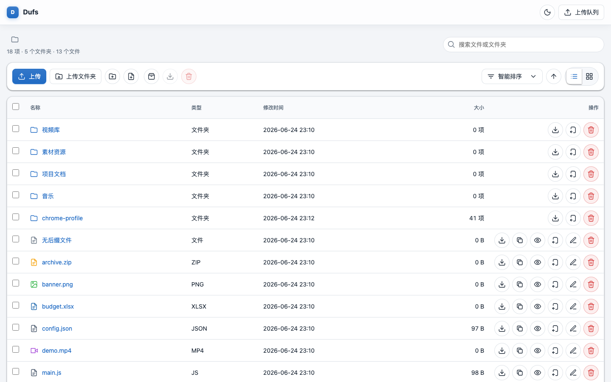
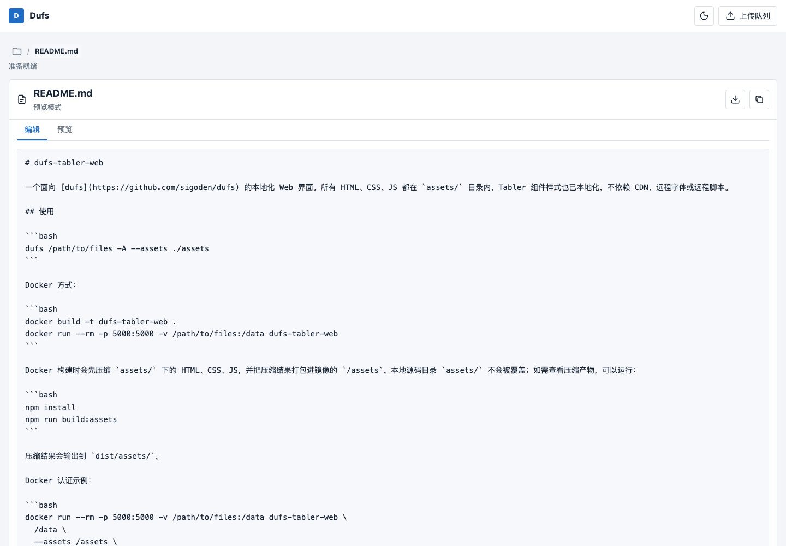

# dufs-tabler-web

A localized web interface for [dufs](https://github.com/sigoden/dufs). All HTML, CSS, and JavaScript live in the `assets/` directory, and the Tabler component styles are bundled locally. It does not rely on CDNs, remote fonts, or remote scripts.

[中文 README](README_zh.md)

## Preview





## Usage

```bash
dufs /path/to/files -A --assets ./assets
```

Docker:

```bash
docker build -t dufs-tabler-web .
docker run --rm -p 5000:5000 -v /path/to/files:/data dufs-tabler-web
```

The Docker build minifies the HTML, CSS, and JavaScript under `assets/` first, then packages the generated files into `/assets` inside the image. The local source directory `assets/` is not overwritten. To inspect the minified output locally, run:

```bash
npm install
npm run build:assets
```

The generated output is written to `dist/assets/`.

Docker authentication example:

```bash
docker run --rm -p 5000:5000 -v /path/to/files:/data dufs-tabler-web \
  /data \
  --assets /assets \
  --allow-upload \
  --allow-delete \
  --allow-search \
  --allow-archive \
  -a admin:admin@/:rw \
  -b 0.0.0.0 \
  -p 5000
```

Docker Compose:

```bash
docker compose up --build
```

By default, it serves the current directory at `http://127.0.0.1:5050`. You can set the data directory and port with environment variables:

```bash
DUFS_DATA=/path/to/files DUFS_PORT=5000 docker compose up --build
```

Docker Compose authentication mode:

```bash
DUFS_DATA=/path/to/files docker compose --profile auth up --build dufs-auth
```

Authentication mode defaults to `http://127.0.0.1:5051` with `admin/admin` as the username and password.

Example with more granular permissions:

```bash
dufs /path/to/files \
  --assets ./assets \
  --allow-upload \
  --allow-delete \
  --allow-search \
  --allow-archive \
  -a admin:admin@/:rw
```

## Features

- File management: list/grid views, directory-first smart sorting, selection, and batch download/delete.
- File upload: button upload, folder upload, drag-and-drop upload, upload progress, and resumable uploads after failures using dufs `PATCH` with `X-Update-Range: append`.
- File download: streamed file downloads, directory downloads via `?zip`, and automatic `?tokengen` token acquisition before downloads for authenticated users.
- Preview and editing: online editing and preview for text, code, JSON, Markdown, and CSV files, plus previews for images, audio, video, and PDFs.
- Authentication: supports dufs `CHECKAUTH` / `LOGOUT` and shows available actions based on permissions injected by dufs.
- UI: sidebar-free layout with Tabler-style components based on the local `tabler.min.css`.

## Files

- `assets/index.html`: dufs assets entrypoint with the `__INDEX_DATA__` and `__ASSETS_PREFIX__` injection placeholders.
- `assets/tabler.min.css`: local subset of Tabler component styles.
- `assets/index.css`: file manager application styles.
- `assets/index.js`: dufs API adapter and UI interactions.
- `assets/favicon.svg`: local favicon.
- `dist/assets/`: minified output generated by the local build, not committed to the repository.
- `Dockerfile`: packages the local UI assets on top of `sigoden/dufs` and serves `/data` by default.
- `docker-compose.yml`: builds and runs dufs locally, including the default service and authentication profile.
